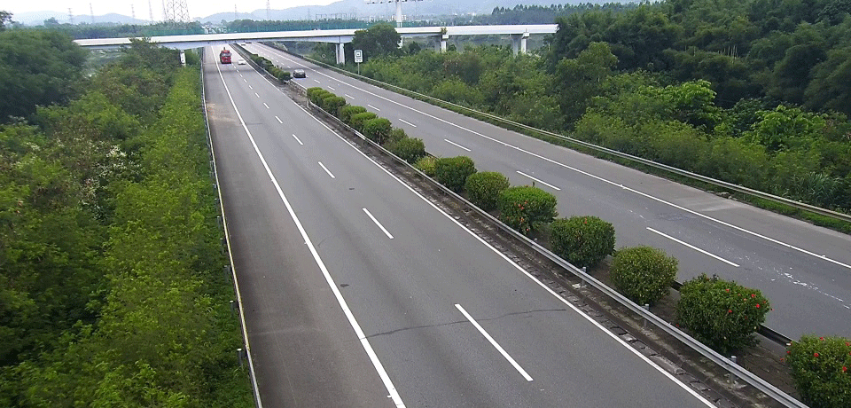

Simple python implementation of Augmentation for small object detection, as described in [Augmentation for small object detection
](https://arxiv.org/pdf/1902.07296.pdf).  


---
**Increased the choice of regions**  



## Usage
**Note : Use Python3**  
The background picture is placed in the `./background`  
The small object picture is placed in the  `./crops`


## Demo
```shell
sh createTrain.sh
python demo.py
```
